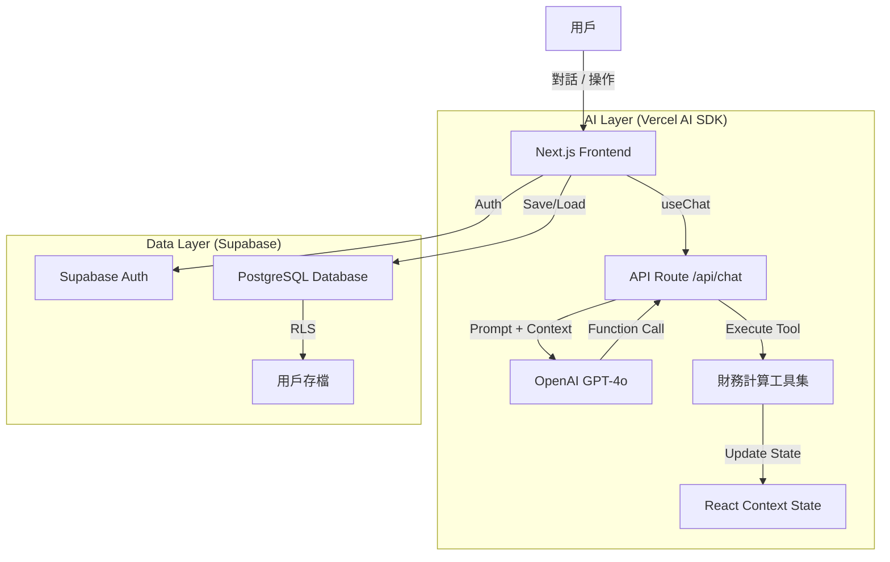

# P&L 計算工具 - AI 升級與雲端化執行計畫書

## 1. 專案願景與目標

將現有的「靜態計算器」升級為 **「AI 賦能的智慧財務 SaaS」**。
*   **智慧化**：透過對話介面，讓 AI 代理人 (Agent) 協助用戶進行模糊目標規劃、參數調優與邏輯檢查。
*   **雲端化**：提供用戶帳戶系統，支援雲端存檔、讀取、模板管理，讓用戶數據不再流失。

---

## 2. 技術架構選型 (Tech Stack)

### 前端框架 (已定)
*   **Framework**: Next.js 15+ (App Router)
*   **Language**: TypeScript
*   **UI Library**: Radix UI + Tailwind CSS (Shadcn/UI)
*   **State Management**: React Context (`FinanceContext`)

### AI 核心 (新增)
*   **SDK**: **Vercel AI SDK (Core + React)**
    *   *理由*：Next.js 生態首選，完美支援 Streaming (串流回應) 與 Tool Calling (工具調用)，且開發體驗極佳。
    *   *註*：目前已升級至 v5.x 版本，但 Tool Calling 功能遭遇 `Invalid schema` 問題，仍在除錯中。
*   **Model Provider**: **OpenAI (GPT-4o)**
    *   *理由*：目前在 Function Calling 與複雜邏輯推理 (Reasoning) 上表現最穩定，適合處理財務邏輯。

### 後端與資料庫 (新增 - Supabase 方案)
*   **Platform**: **Supabase**
    *   *理由*：Serverless PostgreSQL。提供開箱即用的 **Auth** (身分驗證) 與 **Database**，且支援 Row Level Security (RLS) 確保數據安全。比自建後端更省時。
*   **ORM**: **Prisma** (可選) 或直接使用 **Supabase Client** (推薦，輕量且足夠)。

---

## 3. 系統架構圖



---

## 4. 執行步驟詳細規劃

### Phase 1: 基礎建設與雲端存檔 (Infrastructure)
*目標：讓用戶能註冊、登入，並保存他們辛苦調整好的 P&L 表格。*

1.  **Supabase 專案初始化**
    *   建立 Supabase 專案。
    *   設定 Table schema:
        *   `profiles`: 用戶基本資料。
        *   `projects`: 儲存 P&L 專案資料 (JSON 格式儲存完整 Context)。
        *   `templates`: 儲存用戶自定義模板。
2.  **前端整合 Supabase**
    *   安裝 `@supabase/supabase-js`。
    *   建立 `lib/supabaseClient.ts`。
    *   實作「登入/註冊」按鈕 (支援 Email 或 Google 登入)。
3.  **實作存檔功能**
    *   修改 `FinanceContext` 的 `exportData`，支援上傳至 Supabase。
    *   新增「我的專案」列表頁面，支援從雲端載入數據 (`importData`)。

### Phase 2: AI 大腦與工具定義 (The Brain)
*目標：讓 AI "看懂" 你的財務模型，並定義它能"做什麼"。*

1.  **Vercel AI SDK 安裝**
    *   `npm install ai @ai-sdk/openai zpd`
2.  **定義 System Prompt (系統提示詞)**
    *   撰寫 `lib/ai/prompt.ts`，注入以下知識：
        *   **行業基準**：SLG/RPG 的典型數據範圍。
        *   **專案定義**：解釋 NUU, ARPDAU, 留存曲線的具體定義。
        *   **計算規則**：強調 "Day 0 = 100%" 等核心邏輯。
3.  **定義 AI Tools (工具箱)**
    *   在後端定義 `tools` 物件，讓 AI 能執行動作。核心工具包括：
        *   `get_current_status`: 讀取當前 NUU, 預算, 利潤等關鍵指標。
        *   `update_monthly_params`: 修改指定月份的 NUU/預算/ARPDAU。
        *   `adjust_retention`: 修改留存曲線 (整體抬升或修改特定點)。
        *   `set_strategy`: 切換導入策略 (平均/集中/平緩)。

### Phase 3: 智慧規劃與前端整合 (The Interaction)
*目標：實現對話式的財務調整。*

1.  **建立 API Route** (`app/api/chat/route.ts`)
    *   處理前端發來的訊息，掛載 System Prompt 與 Tools。
    *   設定 `maxSteps: 10` (讓 AI 能進行多步驟思考與修正)。
2.  **前端 Chat UI 改造** (`components/ai-chat-modal.tsx`)
    *   使用 `useChat` hook。
    *   **關鍵技術點**：`onToolCall` (客戶端工具執行)。
        *   當 AI 決定要 "修改 M1 預算" 時，它會回傳一個 function call。
        *   前端攔截這個 call，直接執行 `updateMonth()` (React Context 函數)，實現無縫更新 UI。
3.  **實作「智慧規劃」邏輯**
    *   針對 "目標導向" (如: 淨利400萬)，AI 需要進行 "試算 (Simulation)"。
    *   由於後端無法直接跑前端的 `calculateMetrics`，AI 策略將是：
        *   *AI*: "我先設定一組參數..." -> *Frontend*: 更新 -> *Frontend*: 回報新利潤 -> *AI*: "還差一點，我再微調..." -> *Frontend*: 更新。
        *   這形成一個 **Feedback Loop**。

### Phase 4: 測試與優化 (Polishing)
1.  **邊界測試**：測試極端數值，確保 AI 不會填入負數或不合理的留存率 (>100%)。
2.  **回應優化**：讓 AI 在操作後能解釋它的決策邏輯 (例如："為了達到 400 萬淨利，我將後期的 ARPDAU 提升了 10%...")。

---

## 5. 檔案結構預覽

```
app/
  api/
    chat/
      route.ts       <-- AI 後端邏輯
lib/
  ai/
    tools.ts         <-- 定義 AI 可用的工具
    system-prompt.ts <-- AI 的大腦知識庫
  supabase/
    client.ts        <-- 資料庫連線
    schema.sql       <-- 資料庫結構
```

## 6. 立即行動建議 (Next Steps)

1.  **申請資源**：
    *   OpenAI API Key (需綁卡)。
    *   Supabase 帳號 (免費版即可)。
2.  **優先實作 Phase 1**：
    *   先讓用戶能存檔，這是 SaaS 的基礎。
3.  **接續實作 Phase 2 & 3**：
    *   這是專案的核心亮點，建議按部就班，先從簡單的 "幫我把預算改為..." (單步指令) 開始，再進階到 "幫我規劃..." (多步推理)。