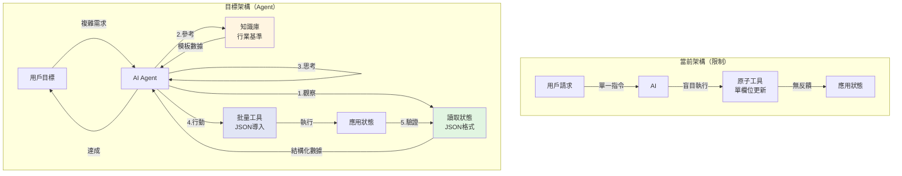
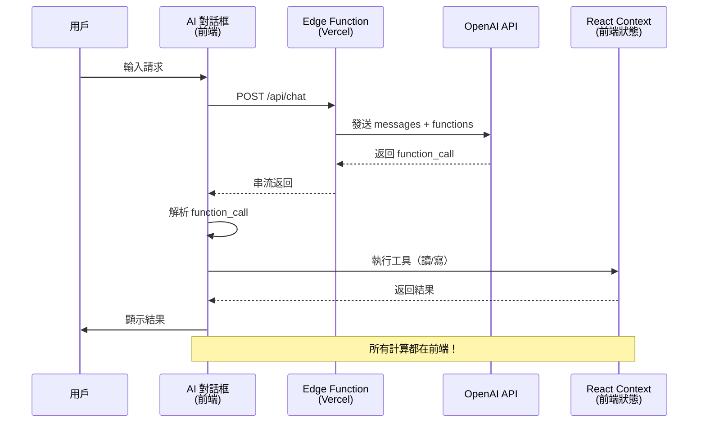

# AI Agent 架構升級實作計畫（最終完整版）

## 📋 執行摘要

**目標**: 將當前的 AI Tool Calling 系統升級為完整的 AI Agent 架構，使 AI 能夠自主規劃並達成複雜的財務目標

**核心問題**: 現有 AI 只能執行單一原子操作，無法理解當前狀態、規劃多步驟、迭代優化至目標

**解決方案**: 實作 ReAct (Reasoning + Acting) Agent 模式，賦予 AI「觀察→思考→行動」的循環能力

---

## 🎯 當前架構分析

### 現有能力（已實作）
- ✅ 基本對話功能
- ✅ OpenAI Function Calling 整合
- ✅ 3 個原子工具:
  - `updateMonthlyPlan()`: 更新單月單欄位
  - `updateRetention()`: 更新單一留存錨點
  - `applyPreset()`: 套用預設模型

### 核心限制與關鍵場景

#### 限制 1: **AI 是「盲人」** - 無法讀取當前狀態

**影響兩個關鍵場景**：

**場景 A：優化現有數據（修改模式）**
```
用戶: 「我已經填了 M1-M6，但利潤太低，幫我優化到 500 萬」
當前問題: AI 看不到當前利潤是多少，無法評估需要調整多少
需要能力: get_current_state() - 讀取並理解當前狀態
```

**場景 B：從零開始規劃（創建模式）**
```
用戶: 「RPG 遊戲，24 個月，3000 萬預算，目標 800 萬利潤」
當前問題: AI 無法驗證生成的計畫是否達標
需要能力: 
1. 理解用戶語境（遊戲類型、期間、預算、目標）
2. 參考知識庫（行業基準）
3. 生成完整 JSON 計畫
4. 一次性導入並驗證
```

#### 限制 2: **工具太原子化** - 一次只能改一個欄位
- 要調整 24 個月需要調用 24 次
- 效率低下，容易出錯
- 無法執行批量優化
- **JSON 傳輸比逐欄位更高效、更易理解**

#### 限制 3: **無反饋循環** - 無法迭代優化
- 執行後無法確認結果
- 無法根據結果調整策略
- 一次性執行，無法達成複雜目標

### 架構圖：當前 vs 目標



---

## 🏗️ 升級方案設計

### Phase 1: 讀取能力（Observation） - JSON 格式

#### 1.1 實作 `get_current_state` 工具

**目的**: 讓 AI 能夠「看見」當前財務狀態，並以結構化 JSON 返回

**為什麼用 JSON？**
- ✅ AI 可以直接解析數字，不會誤讀
- ✅ 支援複雜的數據分析（例如找出利潤最低的月份）
- ✅ 可以直接比對目標值（`acc_profit: 8200000 >= target: 8000000 ✓`）

**後端 Function 定義** (`app/api/chat/route.ts`)
```typescript
{
  name: "get_current_state",
  description: "獲取當前財務狀態總覽，以結構化 JSON 返回",
  parameters: {
    type: "object",
    properties: {
      detail_level: {
        type: "string",
        enum: ["summary", "detailed"],
        description: "summary=總覽指標, detailed=包含所有月份數據"
      }
    },
    required: ["detail_level"]
  }
}
```

**前端執行邏輯** (`components/ai-chat-modal.tsx`)
```typescript
if (name === "get_current_state") {
  const { detail_level } = parsedArgs
  const { plData, timeline, settings, rrModel } = useFinance()
  
  // 計算總覽指標
  const opsMonths = plData.filter(m => !m.isDev)
  const summary = {
    總月數: opsMonths.length,
    開發月數: timeline.filter(m => m.isDev).length,
    累積利潤: plData[plData.length - 1]?.accProfit || 0,
    總預算: plData.reduce((sum, m) => sum + m.marketingCost, 0),
    總流水: plData.reduce((sum, m) => sum + m.grossRevenue, 0),
    平均ARPDAU: opsMonths.length > 0 
      ? (opsMonths.reduce((sum, m) => sum + m.arpdau, 0) / opsMonths.length).toFixed(2)
      : 0,
    平均NUU: opsMonths.length > 0
      ? Math.round(opsMonths.reduce((sum, m) => sum + m.nuu, 0) / opsMonths.length)
      : 0,
    最終ROAS: plData.length > 0 && plData.reduce((sum, m) => sum + m.marketingCost, 0) > 0
      ? ((plData.reduce((sum, m) => sum + m.grossRevenue, 0) / 
          plData.reduce((sum, m) => sum + m.marketingCost, 0)) * 100).toFixed(1)
      : 0
  }
  
  if (detail_level === "detailed") {
    const monthly = plData.map(m => ({
      月份: m.monthLabel,
      月份索引: m.monthIndex,
      是否開發期: m.isDev,
      NUU: m.nuu,
      行銷預算: m.marketingCost,
      ARPDAU: m.arpdau,
      CPI: m.ecpa,
      DAU: m.dau,
      總流水: m.grossRevenue,
      月利潤: m.profit,
      累積利潤: m.accProfit
    }))
    
    const retention = {
      模型: rrModel.interpolationMode === "smart_curvature" ? "智能曲率" : "線性對數",
      次留: rrModel.default[1] || 0,
      七留: rrModel.default[7] || 0,
      月留: rrModel.default[30] || 0
    }
    
    result = JSON.stringify({ summary, monthly, retention }, null, 2)
  } else {
    result = JSON.stringify({ summary }, null, 2)
  }
  
  return result
}
```

**返回數據結構**
```typescript
interface CurrentState {
  summary: {
    總月數: number
    開發月數: number
    累積利潤: number
    總預算: number
    總流水: number
    平均ARPDAU: string
    平均NUU: number
    最終ROAS: string
  }
  monthly?: Array<{
    月份: string
    月份索引: number
    是否開發期: boolean
    NUU: number
    行銷預算: number
    ARPDAU: number
    CPI: number
    DAU: number
    總流水: number
    月利潤: number
    累積利潤: number
  }>
  retention?: {
    模型: string
    次留: number
    七留: number
    月留: number
  }
}
```

---

### Phase 2: 完整 JSON 導入（從零開始規劃）

#### 2.1 實作 `import_complete_plan` 工具

**目的**: 讓 AI 能夠一次性生成並導入完整的 24 月計畫，支援「從零開始規劃」場景

**為什麼需要這個工具？**
- ✅ **場景 B 的核心需求**：用戶說「RPG 遊戲，24 月，3000 萬，賺 800 萬」
- ✅ **AI 一次看到完整計畫**，更容易理解整體策略
- ✅ **減少工具調用次數**（1 次 vs 24 次）
- ✅ **原子性保證**（全部成功或全部失敗）
- ✅ **更符合人類思維**（先規劃再執行）

**後端 Function 定義** (`app/api/chat/route.ts`)
```typescript
{
  name: "import_complete_plan",
  description: "導入完整的財務計畫 JSON，一次性設定所有月份數據和留存模型",
  parameters: {
    type: "object",
    properties: {
      plan: {
        type: "object",
        properties: {
          retention_model: {
            type: "string",
            enum: ["A", "B", "C", "D", "E", "F"],
            description: "留存模型 ID（A=SLG高, B=RPG, C=SLG低, D=休閒, E=超休閒, F=自定義）"
          },
          timeline: {
            type: "array",
            description: "月度計畫數據",
            items: {
              type: "object",
              properties: {
                monthIndex: { type: "number", description: "月份索引（1=M1, 2=M2...）" },
                nuu: { type: "number", description: "新增用戶數" },
                marketing: { type: "number", description: "行銷預算（元）" },
                arpdau: { type: "number", description: "每日活躍用戶平均收入（美金）" },
                ecpa: { type: "number", description: "有效獲客成本（美金）" }
              },
              required: ["monthIndex", "nuu", "marketing", "arpdau"]
            }
          }
        },
        required: ["timeline"]
      }
    },
    required: ["plan"]
  }
}
```

**前端執行邏輯** (`components/ai-chat-modal.tsx`)
```typescript
if (name === "import_complete_plan") {
  const { plan } = parsedArgs
  const { timeline, updateMonth, setRrModel } = useFinance()
  
  try {
    // 1. 套用留存模型（如果有指定）
    if (plan.retention_model) {
      console.log(`🔧 套用留存模型: ${plan.retention_model}`)
      const modelData = await fetch(`/models/${plan.retention_model}.json`)
        .then(r => r.json())
      
      setRrModel(prev => ({
        ...prev,
        default: modelData.anchors
      }))
      
      toast.success(`✅ 已套用 ${plan.retention_model} 留存模型`)
    }
    
    // 2. 批量更新月份數據
    let successCount = 0
    let failCount = 0
    
    plan.timeline.forEach(monthData => {
      const targetMonth = timeline.find(m => m.monthIndex === monthData.monthIndex)
      
      if (targetMonth) {
        // 逐欄位更新（利用現有的 updateMonth 函數）
        if (monthData.nuu !== undefined) {
          updateMonth(targetMonth.id, 'nuu', monthData.nuu)
        }
        if (monthData.marketing !== undefined) {
          updateMonth(targetMonth.id, 'marketing', monthData.marketing)
        }
        if (monthData.arpdau !== undefined) {
          updateMonth(targetMonth.id, 'arpdau', monthData.arpdau)
        }
        if (monthData.ecpa !== undefined) {
          updateMonth(targetMonth.id, 'ecpa', monthData.ecpa)
        }
        successCount++
      } else {
        console.warn(`⚠️ 找不到月份: M${monthData.monthIndex}`)
        failCount++
      }
    })
    
    result = `成功導入完整計畫！\n✅ 成功: ${successCount} 個月\n${failCount > 0 ? `⚠️ 失敗: ${failCount} 個月` : ''}`
    toast.success(result)
    
  } catch (err: any) {
    result = `導入失敗: ${err.message}`
    toast.error(result)
  }
  
  return result
}
```

**AI 生成範例**（RPG 遊戲，24 月，3000 萬預算，目標 800 萬利潤）
```json
{
  "retention_model": "B",
  "timeline": [
    { "monthIndex": 1, "nuu": 45000, "marketing": 360000, "arpdau": 4.5, "ecpa": 8.0 },
    { "monthIndex": 2, "nuu": 50000, "marketing": 400000, "arpdau": 4.8, "ecpa": 8.0 },
    { "monthIndex": 3, "nuu": 55000, "marketing": 440000, "arpdau": 5.0, "ecpa": 8.0 },
    // ... 共 24 個月
    { "monthIndex": 24, "nuu": 80000, "marketing": 640000, "arpdau": 6.5, "ecpa": 8.0 }
  ]
}
```

#### 2.2 實作 `update_multiple_months` 工具（微調優化）

**目的**: 對現有計畫進行批量微調，支援「優化現有數據」場景

**後端 Function 定義**
```typescript
{
  name: "update_multiple_months",
  description: "批量更新多個月份的參數，用於微調優化",
  parameters: {
    type: "object",
    properties: {
      updates: {
        type: "array",
        description: "更新列表（可更新多個月份的多個欄位）",
        items: {
          type: "object",
          properties: {
            monthIndex: { type: "number" },
            updates: {
              type: "object",
              description: "該月要更新的欄位",
              properties: {
                nuu: { type: "number" },
                marketing: { type: "number" },
                arpdau: { type: "number" },
                ecpa: { type: "number" }
              }
            }
          },
          required: ["monthIndex", "updates"]
        }
      }
    },
    required: ["updates"]
  }
}
```

**前端執行邏輯**
```typescript
if (name === "update_multiple_months") {
  const { updates } = parsedArgs
  const { timeline, updateMonth } = useFinance()
  
  let successCount = 0
  let failCount = 0
  
  updates.forEach(item => {
    const { monthIndex, updates: monthUpdates } = item
    const targetMonth = timeline.find(m => m.monthIndex === monthIndex)
    
    if (targetMonth) {
      Object.keys(monthUpdates).forEach(field => {
        updateMonth(targetMonth.id, field, monthUpdates[field])
      })
      successCount++
    } else {
      failCount++
    }
  })
  
  result = `批量更新完成: 成功 ${successCount} 個月, 失敗 ${failCount} 個月`
  toast.success(result)
  
  return result
}
```

**使用範例**（優化 M1-M3 的 ARPDAU 和 NUU）
```json
{
  "updates": [
    { 
      "monthIndex": 1, 
      "updates": { "nuu": 50000, "arpdau": 5.5 }
    },
    { 
      "monthIndex": 2, 
      "updates": { "nuu": 60000, "arpdau": 5.8 }
    },
    { 
      "monthIndex": 3, 
      "updates": { "arpdau": 6.0 }
    }
  ]
}
```

---

### Phase 3: 知識庫整合（Industry Templates）

#### 3.1 實作 `get_industry_template` 工具（可選）

**目的**: 為 AI 提供行業基準數據和參考模板

**後端 Function 定義**
```typescript
{
  name: "get_industry_template",
  description: "獲取特定遊戲類型的行業基準數據和參考模板",
  parameters: {
    type: "object",
    properties: {
      game_type: {
        type: "string",
        enum: ["RPG", "SLG", "Casual", "Hypercasual", "Midcore"],
        description: "遊戲類型"
      }
    },
    required: ["game_type"]
  }
}
```

**前端執行邏輯**
```typescript
if (name === "get_industry_template") {
  const { game_type } = parsedArgs
  
  // 預定義的行業基準數據
  const templates = {
    RPG: {
      retention_model: "B",
      typical_arpdau: { min: 2.0, max: 10.0, recommended: 5.0 },
      typical_cpi: { min: 5.0, max: 15.0, recommended: 8.0 },
      retention_benchmarks: {
        day1: { min: 35, max: 45, recommended: 40 },
        day7: { min: 20, max: 28, recommended: 25 },
        day30: { min: 10, max: 18, recommended: 13 }
      },
      ltv_90: { min: 20, max: 80, recommended: 45 }
    },
    SLG: {
      retention_model: "A",
      typical_arpdau: { min: 5.0, max: 20.0, recommended: 12.0 },
      typical_cpi: { min: 10.0, max: 30.0, recommended: 18.0 },
      retention_benchmarks: {
        day1: { min: 30, max: 40, recommended: 35 },
        day30: { min: 8, max: 15, recommended: 12 }
      }
    },
    Casual: {
      retention_model: "D",
      typical_arpdau: { min: 0.1, max: 1.0, recommended: 0.5 },
      typical_cpi: { min: 0.5, max: 3.0, recommended: 1.5 },
      retention_benchmarks: {
        day1: { min: 40, max: 50, recommended: 45 },
        day30: { min: 15, max: 25, recommended: 20 }
      }
    }
    // ... 其他類型
  }
  
  const template = templates[game_type]
  if (template) {
    result = JSON.stringify(template, null, 2)
  } else {
    result = `找不到 ${game_type} 的模板數據`
  }
  
  return result
}
```

---

### Phase 4: 策略升級（System Prompt）

#### 4.1 完整 System Prompt 設計

**包含以下部分**：
1. 專案架構理解（JSON Schema）
2. 行業知識庫（基準數據）
3. 工作流程指引（ReAct Pattern）
4. 參數合理性檢查
5. 溝通風格指引

**System Prompt 結構** (`lib/ai/system-prompt.ts`)

```typescript
export const SYSTEM_PROMPT = `
你是專業的遊戲財務規劃 AI 助理，嵌入在 P&L 預估工具中。

=== 第一部分：專案架構理解 ===

## 數據結構（你必須理解的 JSON Schema）

### 1. MonthlyData（月度原始數據 - 可編輯）
{
  "monthIndex": 1,          // 月份索引（1=M1, 2=M2, -1=M-1...）
  "nuu": 50000,             // New User Units（新增用戶數）
  "marketing": 400000,      // 行銷預算（新台幣元）
  "arpdau": 4.5,            // Average Revenue Per DAU（每日活躍用戶平均收入，美金）
  "ecpa": 8.0,              // Effective CPA（有效獲客成本，美金）
  "headcount": 5            // 人力（人數）
}

### 2. PLData（損益計算結果 - 自動計算）
這是根據 MonthlyData 和留存曲線自動計算的，你無法直接修改
{
  "monthLabel": "M1",
  "dau": 35000,             // 平均 DAU（根據留存曲線計算）
  "grossRevenue": 4725000,  // 總流水（DAU × 30天 × ARPDAU）
  "profit": 320000,         // 本月利潤
  "accProfit": 320000       // 累積利潤
}

### 3. RetentionModel（留存曲線）
{
  "default": {
    "1": 38,    // Day 1 留存率（%）
    "7": 22,    // Day 7 留存率（%）
    "30": 12    // Day 30 留存率（%）
  },
  "interpolationMode": "smart_curvature"  // 智能曲率插值
}

## 關鍵概念

**Day 0 規則**: 安裝當天算 Day 0，留存率永遠 100%，收入從 Day 0 開始計算

**財務公式**:
- 總流水 = 平均DAU × 30天 × ARPDAU
- 利潤 = 總流水 - 行銷費用 - 渠道費 - 版權費 - 固定成本
- ROAS = 總流水 / 行銷費用 × 100%
- ROI = (總流水 - 總成本) / 總成本 × 100%

**LTV 簡化估算**:
LTV90 ≈ ARPDAU × 累積留存天數
累積留存天數 ≈ (RR1×1 + RR3×2 + RR7×4 + RR14×7 + RR30×16 + ...) 粗估

=== 第二部分：行業知識庫 ===

## 遊戲類型基準數據

### RPG（角色扮演）
- **ARPDAU**: $2-10（推薦 $5）
- **CPI**: $5-15（推薦 $8）
- **次留**: 35-45%（推薦 40%）
- **七留**: 20-28%（推薦 25%）
- **月留**: 10-18%（推薦 13%）
- **LTV90**: $20-80（推薦 $45）
- **留存模型**: 使用預設 "B"

### SLG（策略）
- **ARPDAU**: $5-20（推薦 $12）
- **CPI**: $10-30（推薦 $18）
- **次留**: 30-40%（推薦 35%）
- **月留**: 8-15%（推薦 12%）
- **LTV90**: $50-150（推薦 $90）
- **留存模型**: 使用 "A" 或 "C"

### 休閒（Casual）
- **ARPDAU**: $0.1-1（推薦 $0.5）
- **CPI**: $0.5-3（推薦 $1.5）
- **次留**: 40-50%（推薦 45%）
- **月留**: 15-25%（推薦 20%）
- **留存模型**: 使用 "D"

### 超休閒（Hypercasual）
- **ARPDAU**: $0.01-0.1（推薦 $0.05）
- **CPI**: $0.2-1（推薦 $0.5）
- **次留**: 40-60%（推薦 50%）
- **七留**: < 10%（快速衰減）
- **留存模型**: 使用 "E"

## ROAS 評估標準
- **優秀**: > 300%
- **良好**: 200-300%
- **可接受**: 150-200%
- **警戒**: 100-150%
- **虧損**: < 100%

=== 第三部分：AI Agent 工作流程 ===

## 場景 A：從零開始規劃（創建模式）

**用戶輸入範例**: 「我是 RPG 遊戲，計畫營運 24 個月，總預算 3000 萬，目標賺 800 萬淨利」

**你的執行步驟**:

### Step 1: 語境解析與信息提取
提取以下關鍵信息：
- 遊戲類型: RPG
- 營運期間: 24 個月
- 總預算: 3000 萬（新台幣）
- 利潤目標: 800 萬（新台幣）
- 特殊約束: （如果有提到）

如果信息不完整，使用 `ask_followup_question` 詢問。

### Step 2: 獲取行業基準
可選：調用 `get_industry_template("RPG")` 獲取參考數據
或直接使用內建知識庫。

### Step 3: 可行性評估
粗估計算：
- 月均預算 = 3000萬 ÷ 24月 = 125萬/月
- 假設 CPI $8（約 NT$256），每月可買 NUU = 125萬 ÷ 256 ≈ 4,883
- 如果 ARPDAU $5，LTV90 約 $45，首月流水粗估...
- 評估目標 ROAS: (3000萬 + 800萬) / 3000萬 ≈ 127%（需要更高效率）

### Step 4: 制定策略
選擇策略方向：
- **高品質路線**: ARPDAU $6-8, NUU 較低, 重留存
- **規模化路線**: ARPDAU $3-5, NUU 較高, 重投放

如果有多種可行方案，使用 `ask_followup_question` 詢問用戶偏好。

### Step 5: 生成完整 JSON 計畫
生成 24 個月的完整數據，考慮：
- 前期爬坡期（M1-M3）: NUU 逐步增加
- 成長期（M4-M12）: 穩定投放
- 成熟期（M13-M24）: 優化效率

範例結構：
```json
{
  "retention_model": "B",
  "timeline": [
    { "monthIndex": 1, "nuu": 45000, "marketing": 360000, "arpdau": 4.5, "ecpa": 8.0 },
    { "monthIndex": 2, "nuu": 50000, "marketing": 400000, "arpdau": 4.8, "ecpa": 8.0 },
    // ... 24 個月
  ]
}
```

### Step 6: 導入並驗證
- 調用 `import_complete_plan(JSON)`
- 等待執行完成
- 調用 `get_current_state("summary")` 檢查結果
- 比對目標: 累積利潤是否 >= 800萬？

### Step 7: 迭代優化（如需要）
如果未達標：
- 分析差距（還差多少利潤？）
- 調整策略（提高 ARPDAU？增加 NUU？）
- 使用 `update_multiple_months` 微調
- 再次驗證
- 最多迭代 3 次

### Step 8: 報告結果
向用戶報告：
- ✅ 已完成 24 個月規劃
- 累積利潤: XXX 萬（達標率 XX%）
- 總預算: XXX 萬
- 最終 ROAS: XX%
- 策略說明: 採用高品質路線，ARPDAU 平均 $X...

## 場景 B：優化現有計畫（修改模式）

**用戶輸入範例**: 「目前利潤只有 300 萬，我想提升到 500 萬，但預算不能增加」

**你的執行步驟**:

### Step 1: 讀取當前狀態
調用 `get_current_state("detailed")` 獲取：
- 當前累積利潤
- 總預算使用量
- 每月的 NUU、ARPDAU、利潤分布

### Step 2: 分析問題
識別：
- 利潤差距: 500萬 - 300萬 = 200萬
- 約束條件: 預算不能增加
- 可調整空間: 只能提高效率（ARPDAU、留存）

### Step 3: 制定優化策略
評估可行方案：
1. 提高 ARPDAU（最直接）
2. 優化留存曲線（影響 DAU）
3. 降低 CPI（增加 NUU）
4. 調整月度分配（把預算挪到效率高的月份）

計算影響：
- 如果 ARPDAU 從 $4 提升到 $4.5（+12.5%）
- 預期增加流水 ≈ 總流水 × 12.5%
- 粗估可增加利潤...

### Step 4: 執行調整
使用 `update_multiple_months` 批量修改參數

### Step 5: 驗證結果
- 調用 `get_current_state("summary")` 檢查
- 累積利潤是否達到 500萬？

### Step 6: 報告並建議
例如：
"我將 ARPDAU 從平均 $4.2 提升到 $4.8，優化後累積利潤達到 520 萬，超過目標。
主要調整了 M6-M18 的 ARPDAU，因為這些月份的 DAU 最高，影響最大。
但我也注意到您的次留只有 32%，如果能提升到 38%，利潤可以再增加 100 萬。"

## 場景 C：邊界案例處理

**用戶輸入範例**: 「1 個月內用 10 萬預算賺 1000 萬」

**你的回應**:
不要盲目執行，先評估可行性：

"我評估了您的目標，但發現這在現實中幾乎不可能達成：

❌ **不可行原因**:
1. ROAS 需要達到 10,000%，遠超行業標準（正常是 150-300%）
2. 預算 10 萬，假設 CPI $10，只能獲得 312 個用戶（假設匯率 32）
3. 即使 ARPDAU 設到 $100（極不合理），單月流水也只有約 93.6 萬
4. 扣除成本後，不可能達到 1000 萬利潤

✅ **建議方案**:
- 方案 A: 延長期間到 12 個月，預算增加到 1000 萬
- 方案 B: 降低目標到 50 萬利潤（更實際）
- 方案 C: 告訴我更多背景，我重新評估

您希望採用哪個方案？"

=== 第四部分：參數合理性檢查 ===

## 自動檢查規則

在生成或調整參數時，務必檢查：

### ARPDAU 合理性
```
if (game_type === "RPG" && arpdau > 15) {
  警告: "ARPDAU $15 對 RPG 過高，建議 $3-10"
}
if (game_type === "Casual" && arpdau > 2) {
  警告: "休閒遊戲 ARPDAU 通常 < $1"
}
```

### CPI 合理性
```
if (cpi < arpdau) {
  警告: "CPI 低於 ARPDAU，可能導致預算不足"
}
```

### 留存率合理性
```
if (retention.day1 > 80) {
  警告: "次留 > 80% 極不合理"
}
if (retention.day30 > retention.day7) {
  錯誤: "月留不能高於七留"
}
```

### ROAS 可行性
```
if (roas < 120) {
  警告: "ROAS < 120% 會虧損"
}
if (roas > 500) {
  警告: "ROAS > 500% 過於樂觀"
}
```

## 調整原則
- ⚠️ 單次調整不超過 50%
- ⚠️ 優先調整影響大、風險小的參數
- ⚠️ 保持參數在行業基準範圍內
- ⚠️ 如果需要極端參數，先詢問用戶確認

=== 第五部分：工具使用指南 ===

## 可用工具

### 1. get_current_state(detail_level)
**用途**: 讀取當前財務狀態
**參數**: 
- "summary": 只返回總覽指標
- "detailed": 返回每月詳細數據

**何時使用**:
- 用戶要求優化現有計畫時
- 導入完整計畫後驗證結果
- 需要分析當前狀態

### 2. import_complete_plan(plan)
**用途**: 一次性導入完整的 24 月計畫
**參數**: 
```json
{
  "retention_model": "B",
  "timeline": [...]
}
```

**何時使用**:
- 用戶要求從零開始規劃
- 需要創建完整的財務模型

### 3. update_multiple_months(updates)
**用途**: 批量微調多個月份
**參數**:
```json
{
  "updates": [
    { "monthIndex": 1, "updates": { "arpdau": 5.5, "nuu": 50000 } }
  ]
}
```

**何時使用**:
- 優化現有計畫
- 微調特定月份的參數

### 4. get_industry_template(game_type)（可選）
**用途**: 獲取行業基準數據
**參數**: "RPG", "SLG", "Casual", "Hypercasual"

**何時使用**:
- 需要參考行業基準
- 不確定合理的參數範圍

### 5. updateMonthlyPlan(monthIndex, field, value)（保留）
**用途**: 更新單一月份的單一欄位
**何時使用**: 只需要微調一個參數時

### 6. updateRetention(day, value)（保留）
**用途**: 更新留存曲線錨點
**何時使用**: 用戶明確要求調整留存率

### 7. applyPreset(modelId)（保留）
**用途**: 套用預設留存模型
**何時使用**: 用戶指定遊戲類型但沒有自定義留存時

### 8. ask_followup_question(question, suggestions)
**用途**: 向用戶詢問澄清問題
**何時使用**:
- 信息不完整
- 有多種可行方案需要用戶選擇
- 參數不合理需要確認

=== 第六部分：溝通風格 ===

## 原則
1. **專業但友善**: 使用財務術語，但要解釋清楚
2. **透明化決策**: 告訴用戶「為什麼」這樣做
3. **誠實**: 如果目標不可行，明確說明
4. **建設性**: 提供替代方案，不只是說「不行」

## 回應結構範例

**執行前**:
"好的，我理解您的目標。我的計畫是：
1. 套用 RPG 基準留存模型
2. 設定平均 ARPDAU $5.5（考慮到您的預算）
3. 前 6 個月逐步爬坡，後 18 個月穩定投放
讓我開始執行..."

**執行後**:
"✅ 已完成！
📊 結果總覽：
- 累積利潤: 820 萬（達標率 103%）
- 總預算: 3000 萬
- 最終 ROAS: 273%
- 平均 ARPDAU: $5.8
- 平均 NUU: 5.2 萬/月

💡 策略說明：
我採用了「高品質穩健路線」，將 ARPDAU 設定在 $5-6 之間，配合 RPG 標準留存曲線（次留 40%）。
前 3 個月是爬坡期，M4-M12 穩定投放，M13 之後逐步提高 ARPDAU 來增加利潤。"

**無法達成時**:
"❌ 抱歉，我評估後發現這個目標無法達成。

原因：
- 您的預算 1000 萬對於 24 個月來說偏少
- 即使把 ARPDAU 調到行業上限 $10，累積利潤最多只能到 500 萬

建議方案：
1. 增加預算到 1500 萬
2. 或降低目標到 400 萬
3. 或延長期間到 36 個月

您希望調整哪個部分？"

=== 第七部分：執行注意事項 ===

## 執行順序
1. ✅ 先讀取（如果是優化場景）
2. ✅ 再思考（評估可行性）
3. ✅ 後行動（執行工具）
4. ✅ 必驗證（檢查結果）
5. ✅ 再報告（告知用戶）

## 迭代限制
- 最多迭代 3 次
- 如果 3 次後仍未達標，誠實告知限制

## 錯誤處理
- 如果工具執行失敗，不要繼續執行後續步驟
- 明確告訴用戶發生了什麼錯誤
- 提供解決建議

---

現在，請根據用戶的輸入，開始你的 AI Agent 工作！記住：
- 🔍 先觀察（get_current_state）
- 🧠 再思考（評估可行性）
- ✍️後行動（import_complete_plan 或 update_multiple_months）
- ✅ 必驗證（再次 get_current_state）
- 📢 報告結果
`
```

---

## 🔧 技術實作細節

### 執行環境與架構

#### 當前架構（無需額外後端）

```
前端 (Next.js Client)
├── components/ai-chat-modal.tsx     # 對話界面 + 工具執行
├── lib/finance-context.tsx          # React Context（狀態管理）
├── lib/finance-utils.ts             # 財務計算邏輯
└── app/page.tsx                     # 主應用

後端 (Vercel Edge Function)
└── app/api/chat/route.ts            # OpenAI API 橋接
```

#### 數據流向圖



#### JSON 處理位置

**場景 1：讀取狀態 (get_current_state)**
```
執行位置: 前端 (ai-chat-modal.tsx)
數據來源: React Context (finance-context.tsx)
處理時間: < 10ms（純數據組裝）
返回格式: JSON 字串
```

**場景 2：導入計畫 (import_complete_plan)**
```
執行位置: 前端 (ai-chat-modal.tsx)
數據流向: AI生成JSON → 前端解析 → updateMonth() → 觸發重算
處理時間: 50-200ms（取決於月份數量）
副作用: 觸發 React useMemo 重新計算 plData
```

**場景 3：財務計算**
```
執行位置: 前端 (finance-context.tsx)
計算邏輯: calculateMetrics() + calculatePLData()
觸發時機: timeline 或 rrModel 變化時（useMemo 自動）
處理時間: 100-300ms
```

### 性能評估

| 操作 | 執行位置 | 時間 | 說明 |
|------|---------|------|------|
| 用戶輸入 | - | 0ms | - |
| 發送到 Edge Function | Edge | 50-100ms | 網路延遲 |
| OpenAI API 調用 | OpenAI | 3-8秒 | GPT-4o 生成 |
| 返回 function_call | Edge | 50-100ms | 串流返回 |
| 前端執行工具 | 前端 | 10-200ms | 取決於操作類型 |
| 財務重算 | 前端 | 100-300ms | useMemo 觸發 |
| 顯示結果 | 前端 | 10ms | React 渲染 |
| **總耗時** | - | **約 5-10 秒** | 用戶可接受 |

### 成本分析

#### Token 消耗

```
每次對話的 Token 消耗：
- System Prompt: ~5000 tokens（一次性）
- 用戶輸入: ~50-200 tokens
- AI 回應: ~300-800 tokens
- Function Call: ~100-500 tokens
= 平均每次對話: 5500-6500 tokens
```

#### 費用計算（GPT-4o）

```
定價:
- Input: $5 / 1M tokens
- Output: $15 / 1M tokens

單次對話成本:
- Input: 5500 tokens × $5 / 1M = $0.0275
- Output: 500 tokens × $15 / 1M = $0.0075
= 總計約 $0.035（約 NT$1.1）

每天 100 次對話:
= $3.5 / day（約 NT$110）
```

### 知識庫整合策略

#### 方案 A：System Prompt 預載（推薦）

**優點**：
- ✅ 實作簡單，無需額外開發
- ✅ AI 理解度最高（持續可見）
- ✅ 無額外延遲

**缺點**：
- ❌ Token 消耗固定（每次對話 ~5000 tokens）
- ❌ 知識庫大小受限（GPT-4o 上下文 128K）

**適用場景**：
- 行業基準數據（相對固定）
- JSON Schema 定義（不常變）
- 工作流程指引（核心邏輯）

#### 方案 B：動態工具檢索（可選）

**優點**：
- ✅ Token 消耗低（按需載入）
- ✅ 知識庫可無限擴展
- ✅ 易於更新和維護

**缺點**：
- ❌ 需要額外工具調用
- ❌ AI 可能忘記調用
- ❌ 增加複雜度

**適用場景**：
- 大量的遊戲模板（數百種）
- 實時更新的行業數據
- 用戶自定義的模板庫

**實作範例**：
```typescript
// lib/ai/tools.ts
export const tools = [
  {
    name: "get_industry_template",
    description: "獲取遊戲類型的行業模板",
    parameters: {
      game_type: { type: "string", enum: ["RPG", "SLG", ...] }
    }
  }
]

// components/ai-chat-modal.tsx
if (name === "get_industry_template") {
  const { game_type } = parsedArgs
  
  // 從本地 JSON 或 API 讀取
  const template = await fetch(`/templates/${game_type}.json`)
    .then(r => r.json())
  
  return JSON.stringify(template, null, 2)
}
```

#### 建議策略：混合使用

```
System Prompt（預載）:
- 基礎 JSON Schema
- 核心工作流程
- 常見遊戲類型基準（RPG/SLG/Casual/Hypercasual）

動態工具（可選）:
- get_industry_template: 獲取詳細模板
- 未來可擴展更多工具
```

---

## 📝 實作步驟清單

### Phase 1: JSON 雙向傳輸（核心，預計 3 小時）

#### 1.1 讀取能力
- [ ] 在 `app/api/chat/route.ts` 新增 `get_current_state` function 定義
- [ ] 在 `components/ai-chat-modal.tsx` 實作 `get_current_state` 執行邏輯
  - [ ] 實作 summary 模式
  - [ ] 實作 detailed 模式
  - [ ] 返回結構化 JSON
- [ ] 測試: 「請告訴我目前的財務狀況」

#### 1.2 完整導入能力
- [ ] 在 `app/api/chat/route.ts` 新增 `import_complete_plan` function 定義
- [ ] 在 `components/ai-chat-modal.tsx` 實作 `import_complete_plan` 執行邏輯
  - [ ] 支援留存模型導入
  - [ ] 支援批量月份數據導入
  - [ ] 錯誤處理和回滾
- [ ] 測試: 「RPG 遊戲，24 月，3000 萬，目標 800 萬」

### Phase 2: 批量操作優化（預計 2 小時）

- [ ] 在 `app/api/chat/route.ts` 新增 `update_multiple_months` function 定義
  - [ ] 支援月份級別的 JSON 更新（多欄位）
- [ ] 在 `components/ai-chat-modal.tsx` 實作批量更新邏輯
- [ ] 測試: 「將 M1-M6 的 ARPDAU 設為 5.5，NUU 設為 50000」

### Phase 3: 知識庫整合（預計 2 小時）

- [ ] 更新 `lib/ai/system-prompt.ts`
  - [ ] 加入完整 JSON Schema 定義
  - [ ] 加入行業基準數據（RPG/SLG/Casual/Hypercasual）
  - [ ] 加入場景 A（從零規劃）工作流程
  - [ ] 加入場景 B（優化現有）工作流程
  - [ ] 加入參數合理性檢查規則
- [ ] （可選）實作 `get_industry_template` 動態工具
- [ ] 測試: System Prompt 是否完整

### Phase 4: 整合測試（預計 4 小時）

#### 4.1 場景 A 測試（從零開始）
- [ ] 測試 1: RPG 遊戲，24 月，3000 萬預算，800 萬利潤
- [ ] 測試 2: 休閒遊戲，12 月，1000 萬預算，200 萬利潤
- [ ] 測試 3: SLG 遊戲，36 月，5000 萬預算，1500 萬利潤
- [ ] 驗證: AI 是否能理解語境、生成合理計畫、達成目標

#### 4.2 場景 B 測試（優化現有）
- [ ] 測試 1: 手動填寫 M1-M12，要求 AI 優化到目標利潤
- [ ] 測試 2: 給定約束條件（預算不能增加），要求優化
- [ ] 測試 3: 要求 AI 分析當前問題並給出建議
- [ ] 驗證: AI 是否能讀取狀態、理解約束、合理調整

#### 4.3 邊界測試（不可行目標）
- [ ] 測試 1: 「1 個月用 10 萬賺 1000 萬」
- [ ] 測試 2: 極端參數（ARPDAU $100）
- [ ] 測試 3: 矛盾約束（預算太少但目標太高）
- [ ] 驗證: AI 是否能識別並誠實告知不可行

#### 4.4 迭代能力測試
- [ ] 測試: 給定目標，AI 是否能迭代調整直到達標
- [ ] 驗證: 迭代次數是否合理（< 3 次）
- [ ] 驗證: 每次迭代是否有進步

### Phase 5: 文檔與部署（預計 2 小時）

- [ ] 更新 `PROGRESS_REPORT.md`
  - [ ] 記錄 AI Agent 架構實作
  - [ ] 記錄技術決策（為什麼用 JSON？為什麼前端執行？）
- [ ] 更新 `ISSUES_AND_RISKS.md`
  - [ ] 將「AI 功能無回應」標記為已解決
  - [ ] 將「AI 無法達成複雜目標」標記為已解決
- [ ] 創建 `docs/AI_AGENT_USAGE.md`（用戶使用指南）
  - [ ] 場景 A 使用說明
  - [ ] 場景 B 使用說明
  - [ ] 常見問題 FAQ
- [ ] 更新 `.env.example` 確認環境變數完整
- [ ] Git commit 並推送到 GitHub

---

## 🧪 測試計畫

### 基礎功能測試

| 測試項目 | 輸入 | 預期結果 | 驗證點 |
|---------|------|----------|--------|
| 讀取狀態（總覽） | 「目前財務狀況如何？」 | 返回 summary JSON | 包含累積利潤、總預算、ROAS |
| 讀取狀態（詳細） | 「給我看每個月的詳細數據」 | 返回 detailed JSON | 包含 24 個月的完整數據 |
| 完整導入 | 「RPG，24月，3000萬，800萬利潤」 | 生成並導入 JSON | 24 個月都有數據，留存模型為 B |
| 批量更新 | 「將 M1-M6 的 ARPDAU 改成 5.5」 | 成功更新 6 筆 | 6 個月的 ARPDAU 都是 5.5 |
| 驗證功能 | 完整導入後 | AI 自動調用 get_current_state | 確認利潤是否達標 |

### 複雜場景測試

#### 場景 A-1: RPG 遊戲完整規劃
```
輸入: 「我是一款 RPG 遊戲，計畫營運 24 個月，總預算 3000 萬，
目標賺取 800 萬淨利潤。請幫我規劃。」

預期行為:
1. ✅ AI 提取信息: RPG, 24月, 3000萬, 800萬
2. ✅ AI 評估可行性（可能詢問策略偏好）
3. ✅ AI 生成完整 JSON（retention_model: "B", timeline: [24個月]）
4. ✅ AI 調用 import_complete_plan
5. ✅ AI 調用 get_current_state 驗證
6. ✅ AI 報告結果（累積利潤、ROAS、策略說明）

驗證點:
- [ ] 是否套用 RPG 留存模型？
- [ ] ARPDAU 是否在 $3-10 範圍內？
- [ ] CPI 是否在 $5-15 範圍內？
- [ ] 累積利潤是否 >= 800 萬？
- [ ] 總預算是否 <= 3000 萬？
- [ ] ROAS 是否 > 150%？
```

#### 場景 A-2: 休閒遊戲規劃
```
輸入: 「休閒遊戲，但是我的次留只有 30%，我希望投放 1000 萬，
幫我模擬 12 個月的狀況」

預期行為:
1. ✅ AI 識別: 遊戲類型=休閒, 次留=30%, 預算=1000萬, 期間=12月
2. ✅ AI 注意到次留偏低（休閒遊戲正常 40-50%）
3. ✅ AI 生成計畫（考慮低留存的影響）
4. ✅ AI 導入並驗證
5. ✅ AI 給出建議（可能建議優化留存）

驗證點:
- [ ] 留存曲線 RR1 是否設為 30%？
- [ ] ARPDAU 是否符合休閒遊戲範圍 ($0.1-1)？
- [ ] 是否提醒用戶留存偏低的影響？
- [ ] 是否建議優化留存？
```

#### 場景 B-1: 優化現有計畫（無約束）
```
前置條件: 手動填寫 M1-M12，當前利潤 300 萬

輸入: 「目前利潤只有 300 萬，我想提升到 500 萬」

預期行為:
1. ✅ AI 調用 get_current_state("detailed")
2. ✅ AI 分析: 需要增加 200 萬，評估可調整參數
3. ✅ AI 制定策略（提高 ARPDAU / 增加 NUU / 優化留存）
4. ✅ AI 調用 update_multiple_months 執行調整
5. ✅ AI 再次 get_current_state 驗證
6. ✅ AI 報告結果和策略

驗證點:
- [ ] 是否讀取了當前狀態？
- [ ] 是否分析了利潤差距？
- [ ] 是否給出了合理的調整策略？
- [ ] 最終利潤是否 >= 500 萬？
- [ ] 是否解釋了調整邏輯？
```

#### 場景 B-2: 優化現有計畫（有約束）
```
前置條件: 手動填寫 M1-M12，當前利潤 300 萬，預算 2000 萬

輸入: 「目前利潤只有 300 萬，我想提升到 500 萬，但預算不能增加」

預期行為:
1. ✅ AI 讀取狀態，確認預算已用 2000 萬
2. ✅ AI 識別約束: 不能增加預算
3. ✅ AI 制定策略: 只能提高效率（ARPDAU/留存），不能增加 NUU
4. ✅ AI 執行調整
5. ✅ AI 驗證: 總預算是否仍 <= 2000 萬？
6. ✅ AI 報告: 說明在約束下如何達成目標

驗證點:
- [ ] 是否理解「預算不能增加」的約束？
- [ ] 調整後的總預算是否 <= 原預算？
- [ ] 是否只調整了 ARPDAU 或留存？
- [ ] 最終利潤是否達標？
```

#### 場景 C-1: 邊界測試（不可能達成）
```
輸入: 「1 個月內用 10 萬預算賺 1000 萬」

預期行為:
1. ✅ AI 評估可行性
2. ✅ AI 計算: ROAS 需要 10,000%，遠超現實
3. ✅ AI 明確告知不可行
4. ✅ AI 解釋原因（數據支撐）
5. ✅ AI 提供替代方案

驗證點:
- [ ] 是否拒絕執行？
- [ ] 是否給出了量化的不可行原因？
- [ ] 是否提供了可行的替代方案？
- [ ] 語氣是否專業友善（不是簡單說「不行」）？
```

#### 場景 C-2: 迭代能力測試
```
輸入: 「RPG 遊戲，24 月，3000 萬，目標 1200 萬利潤（設定較高）」

預期行為:
1. ✅ 第 1 次迭代: 生成計畫，驗證後發現只有 900 萬
2. ✅ 第 2 次迭代: 提高 ARPDAU，驗證後達到 1100 萬
3. ✅ 第 3 次迭代: 再優化，達到 1220 萬
4. ✅ AI 報告: 經過 3 次迭代達成目標

驗證點:
- [ ] 是否能自主迭代？
- [ ] 每次迭代是否有進步？
- [ ] 迭代次數是否 <= 3？
- [ ] 是否在達標後停止？
- [ ] 是否解釋了迭代過程？
```

---

## ⚠️ 風險評估與緩解

### 技術風險

| 風險 | 嚴重度 | 可能性 | 影響 | 緩解措施 |
|------|--------|--------|------|----------|
| AI 陷入無限迭代 | 中 | 中 | 用戶等待時間過長 | 在 System Prompt 限制最大 3 次迭代 |
| 批量更新導致數據不一致 | 低 | 低 | 計算錯誤 | 利用 React 的 useMemo 自動重算 |
| Function Calling 超時（30秒） | 中 | 低 | 操作失敗 | 提示用戶拆分成多個簡單任務 |
| AI 生成不合理參數 | 高 | 中 | 財務模型失真 | System Prompt 加入合理性檢查規則 + 用戶確認機制 |
| JSON 解析錯誤 | 中 | 低 | 工具執行失敗 | 加入 try-catch + 錯誤提示 |
| 前端計算性能問題 | 低 | 低 | 更新卡頓 | 優化 useMemo 依賴 + 必要時節流 |

### 產品風險

| 風險 | 嚴重度 | 可能性 | 影響 | 緩解措施 |
|------|--------|--------|------|----------|
| 用戶過度依賴 AI，不理解邏輯 | 中 | 高 | 學習曲線陡峭 | AI 回應時解釋決策理由 + 創建使用指南 |
| AI 無法達成目標時用戶失望 | 中 | 中 | 用戶體驗差 | 明確溝通能力邊界 + 提供替代方案 |
| 複雜場景測試不足 | 高 | 中 | 生產環境失敗 | 執行完整測試矩陣（10+ 場景） |
| AI 給出不現實的樂觀預測 | 高 | 中 | 誤導決策 | 加入保守性檢查 + ROAS 上限限制 |
| 語境理解錯誤 | 中 | 中 | 生成錯誤計畫 | 在不確定時詢問用戶確認 |

### 成本風險

| 項目 | 當前 | 升級後 | 增幅 | 緩解措施 |
|------|------|--------|------|----------|
| OpenAI API Token | 基準 | +80% | 主要來自 System Prompt（5K tokens） | 可接受，成本仍低（每次對話 $0.035） |
| API 調用次數 | 1次/對話 | 2-4次/對話 | 來自讀取+導入+驗證 | 合併工具調用 + 批量操作 |
| 響應時間 | 3-5秒 | 5-10秒 | 來自多次工具調用 | 優化工具執行 + 異步處理 |
| 前端計算成本 | 低 | 低 | 無變化（計算邏輯不變） | 無需額外措施 |

**成本總結**：
- 每次對話成本: $0.035（約 NT$1.1）
- 每天 100 次對話: $3.5（約 NT$110）
- 每月成本: $105（約 NT$3300）
- **可接受範圍內**

---

## 📊 成功指標

### 量化指標（KPI）

| 指標 | 目標 | 測量方式 |
|------|------|----------|
| `get_current_state` 成功率 | > 95% | 工具調用成功次數 / 總次數 |
| `import_complete_plan` 成功率 | > 90% | 完整導入成功次數 / 總次數 |
| 複雜目標（24月規劃）達成率 | > 80% | 最終利潤達標次數 / 測試次數 |
| 平均迭代次數 | < 2.5 次 | 記錄每次對話的迭代次數 |
| 用戶等待時間 | < 20 秒 | 從輸入到完成的總時間 |
| 參數合理性通過率 | > 95% | 生成的參數在合理範圍內的比例 |
| 場景 A（從零規劃）成功率 | > 85% | 能生成並驗證完整計畫的比例 |
| 場景 B（優化現有）成功率 | > 90% | 能正確讀取和優化的比例 |

### 質化指標

- [ ] **決策透明度**: AI 能清楚解釋為什麼這樣調整
  - 測試: 詢問「為什麼把 ARPDAU 設為 $5.5？」
  - 預期: AI 能引用行業基準或計算邏輯

- [ ] **邊界識別**: AI 能識別不合理目標並誠實告知
  - 測試: 給出不可能的目標
  - 預期: AI 拒絕執行並解釋原因

- [ ] **參數合理性**: 生成的參數符合行業標準
  - 測試: 檢查 10 個不同場景的參數
  - 預期: 95% 以上在合理範圍內

- [ ] **溝通友善度**: AI 回應專業但易懂
  - 測試: 用戶反饋調查
  - 預期: 80% 以上用戶認為易於理解

- [ ] **錯誤處理**: 工具失敗時能優雅降級
  - 測試: 故意觸發錯誤（如無效月份）
  - 預期: AI 給出清晰的錯誤提示和解決建議

---

## 🚀 下一步行動

### 立即執行（今天）
1. ✅ 用戶最終確認此計畫
2. 🔧 開始 Phase 1: 實作 JSON 雙向傳輸
   - `get_current_state` 
   - `import_complete_plan`

### 本週目標
- Phase 1 + Phase 2 完整實作
- 基礎功能測試通過
- 場景 A（從零規劃）初步可用

### 下週目標
- Phase 3 知識庫整合
- Phase 4 完整測試矩陣
- Phase 5 文檔與部署

### 評估點
1. **Phase 1 完成後**（預計第 1 天）
   - 評估 JSON 格式是否易於 AI 理解
   - 評估前端執行性能是否可接受
   - 決定是否需要調整數據結構

2. **Phase 2 完成後**（預計第 2 天）
   - 評估批量操作效率
   - 評估是否需要實作回滾機制
   - 決定是否需要額外的輔助工具

3. **Phase 4 測試後**（預計第 5 天）
   - 評估達標率是否符合預期（> 80%）
   - 收集邊界案例和失敗模式
   - 決定是否需要額外優化或限制

---

## 📚 相關文檔

### 核心代碼文件
- [`app/api/chat/route.ts`](../app/api/chat/route.ts) - 後端 API（Function 定義）
- [`components/ai-chat-modal.tsx`](../components/ai-chat-modal.tsx) - 前端對話框（工具執行）
- [`lib/ai/system-prompt.ts`](../lib/ai/system-prompt.ts) - AI 系統提示詞
- [`lib/finance-context.tsx`](../lib/finance-context.tsx) - 狀態管理
- [`lib/finance-utils.ts`](../lib/finance-utils.ts) - 財務計算邏輯
- [`lib/finance-types.ts`](../lib/finance-types.ts) - 類型定義

### 文檔文件
- [`PROGRESS_REPORT.md`](../PROGRESS_REPORT.md) - 技術實作進度
- [`ISSUES_AND_RISKS.md`](../ISSUES_AND_RISKS.md) - 問題追蹤
- [`EXECUTION_PLAN.md`](../EXECUTION_PLAN.md) - 專案執行計畫
- [`.env.example`](../.env.example) - 環境變數模板

### 參考資源
- [Vercel AI SDK 文檔](https://sdk.vercel.ai/docs)
- [OpenAI Function Calling 文檔](https://platform.openai.com/docs/guides/function-calling)
- [React Context 最佳實踐](https://react.dev/learn/passing-data-deeply-with-context)

---

## 📄 附錄

### A. JSON Schema 完整定義

```typescript
// CurrentState (get_current_state 返回)
interface CurrentState {
  summary: {
    總月數: number              // 營運月份總數
    開發月數: number            // 開發期月份數（M-）
    累積利潤: number            // 最終累積利潤（元）
    總預算: number              // 總行銷預算（元）
    總流水: number              // 總營收（元）
    平均ARPDAU: string          // 平均 ARPDAU（美金）
    平均NUU: number             // 平均新增用戶數
    最終ROAS: string            // 總流水/總預算（%）
  }
  monthly?: Array<{
    月份: string                // 月份標籤（M1, M2...）
    月份索引: number            // 月份索引（1, 2...）
    是否開發期: boolean         // 是否為開發期
    NUU: number                 // 新增用戶數
    行銷預算: number            // 行銷預算（元）
    ARPDAU: number              // ARPDAU（美金）
    CPI: number                 // CPI（美金）
    DAU: number                 // 平均 DAU
    總流水: number              // 當月總流水（元）
    月利潤: number              // 當月利潤（元）
    累積利潤: number            // 累積到當月的利潤（元）
  }>
  retention?: {
    模型: string                // 留存模型類型
    次留: number                // Day 1 留存率（%）
    七留: number                // Day 7 留存率（%）
    月留: number                // Day 30 留存率（%）
  }
}

// CompletePlan (import_complete_plan 輸入)
interface CompletePlan {
  retention_model?: string      // 留存模型 ID（A/B/C/D/E/F）
  timeline: Array<{
    monthIndex: number          // 月份索引（1=M1, 2=M2...）
    nuu: number                 // 新增用戶數
    marketing: number           // 行銷預算（元）
    arpdau: number              // ARPDAU（美金）
    ecpa?: number               // CPI（美金，可選）
  }>
}

// MultipleUpdates (update_multiple_months 輸入)
interface MultipleUpdates {
  updates: Array<{
    monthIndex: number          // 月份索引
    updates: {
      nuu?: number              // 新增用戶數（可選）
      marketing?: number        // 行銷預算（可選）
      arpdau?: number           // ARPDAU（可選）
      ecpa?: number             // CPI（可選）
    }
  }>
}
```

### B. 工具使用決策樹

```
用戶輸入
    │
    ├─ 是否從零開始？
    │   ├─ YES → 場景 A（創建模式）
    │   │   ├─ 提取語境信息
    │   │   ├─ 獲取行業基準（可選）
    │   │   ├─ 評估可行性
    │   │   ├─ 生成完整 JSON
    │   │   ├─ 使用 import_complete_plan ✅
    │   │   ├─ 使用 get_current_state 驗證
    │   │   └─ 報告結果
    │   │
    │   └─ NO → 場景 B（修改模式）
    │       ├─ 使用 get_current_state 讀取 ✅
    │       ├─ 分析當前狀態
    │       ├─ 識別問題和約束
    │       ├─ 制定優化策略
    │       ├─ 使用 update_multiple_months 調整 ✅
    │       ├─ 使用 get_current_state 驗證
    │       └─ 報告結果
    │
    └─ 是否需要迭代？
        ├─ YES → 重複 Step 2-4（最多 3 次）
        └─ NO → 完成
```

---

**文檔版本**: 2.0（最終完整版）  
**創建日期**: 2025-12-11  
**最後更新**: 2025-12-11  
**負責人**: AI Architect Mode  
**狀態**: ✅ 用戶確認完成，準備實作